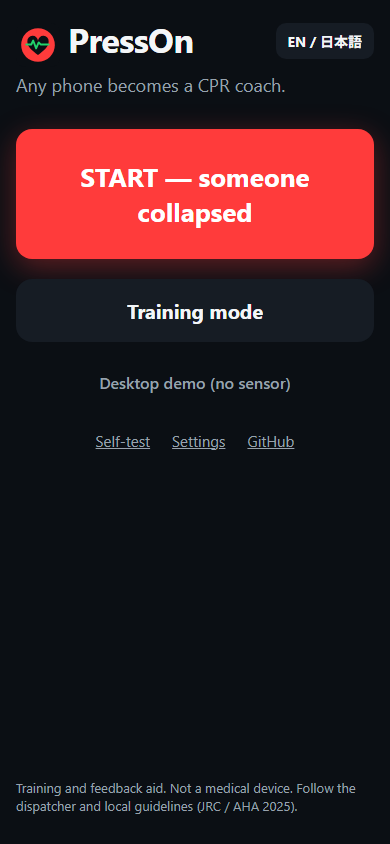
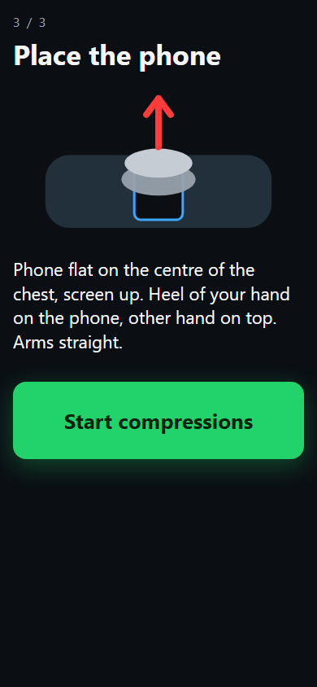
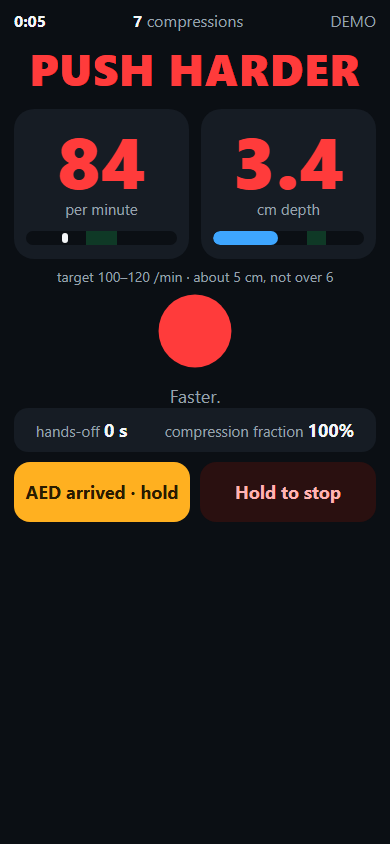
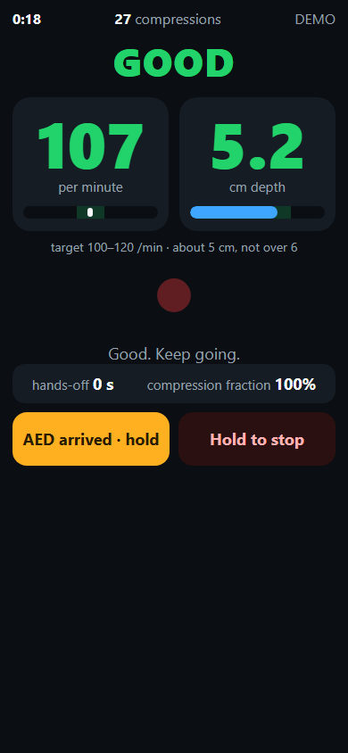
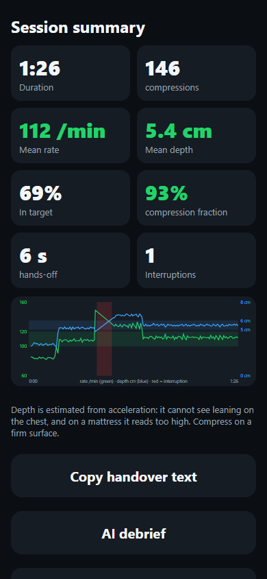
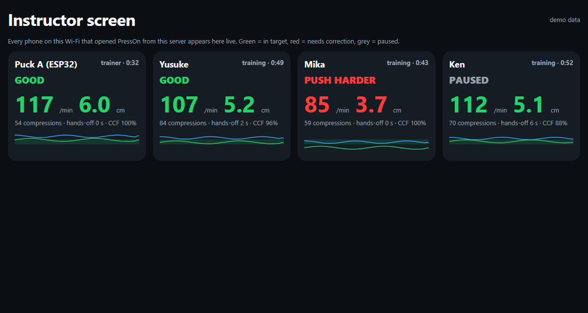
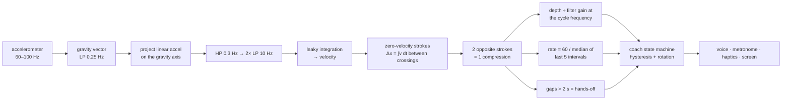

# PressOn — any phone becomes a CPR coach

**Put your phone on the chest, put your hands on the phone, push.** PressOn reads the phone's accelerometer and tells you, out loud, whether you are pushing hard enough and fast enough — the two things untrained rescuers most often get wrong, and two of the strongest quality factors linked to survival in the guidelines.

No app store, no install, no signal needed: open the link once and it works offline. The same algorithm also runs as open firmware on a $5 ESP32 puck that you can run in your browser right now.

<p align="center">
      taro13nyanko
</p>

> VoltHacks 2026 · Smart Health Technology (+ AI + Hardware Integration) · built by a first-year student at the University of Tokyo, alone, with a phone, a cushion and a laptop.

## Try it in 30 seconds

| What | Where |
|---|---|
| **On your phone** (Android Chrome / iOS Safari) | open **https://taro13nyanko.github.io/presson/**, tap **Training mode**, put the phone on a cushion, hands on top, push |
| **On a laptop, no sensor** | same link → **Desktop demo**: a scripted rescue is fed into the real estimator, so you see every screen and hear every cue (`app/index.html?demo=1` auto-starts it; tap once for sound) |
| **Prove the maths** | `app/selftest.html` runs 150 synthetic test cases in your browser and prints the error table below; it also shows your own sensor live |
| **Classroom view** | `app/instructor.html#demo` — the instructor screen with four simulated trainees (the real one needs `tools/serve.py` on the room's Wi-Fi) |
| **Embedded version** | ▶ **[Run the live ESP32 trainer in Wokwi](https://wokwi.com/projects/474093357216243713)** — ESP32 + MPU6050 + OLED + buzzer. Press **DEMO** to watch a full CPR-feedback session. |

## The problem

* In Japan **28,354** cardiac arrests of cardiac origin a year are witnessed by a bystander; bystander first aid (CPR, with or without an AED) is given in only **59.7 %** of them, and one-month survival is **14.8 %** with it vs **7.3 %** without (FDMA, *令和6年版 救急・救助の現況*, data for 2023). The US sees roughly 350,000 out-of-hospital arrests a year with survival around 10 %.
* Survival depends on *quality*: **100–120 compressions/min, about 5 cm deep and not more than 6 cm, minimal interruptions** (JRC 2025 / AHA 2025). Untrained rescuers cannot feel 5 cm, and depth and rate drift with fatigue within a couple of minutes — which is why the guidelines say to switch rescuers every 2 minutes.
* The devices that fix this (Laerdal CPRmeter, Zoll Real CPR Help inside AEDs) cost hundreds of dollars and live in ambulances and cabinets — not in the pocket of the person who is actually kneeling next to the patient.
* Everyone has a phone, and its MEMS accelerometer is the same kind of sensor those pucks use for depth (they add a force sensor for leaning, which a phone lacks).

## What PressOn does

1. **Guided start** — check response → call 119/911 on speaker, send someone for an AED → place the phone. Every step is spoken.
2. **Live coaching** — each compression is detected from the accelerometer; rate and depth are shown in numbers a panicking person can read from a metre away, and a voice says *push harder / faster / slower / good / resume compressions*. A metronome keeps 110/min. Cues are rate-limited and rotate, so it coaches instead of nagging.
3. **Interruptions** — hands off the chest for more than 2 s starts a hands-off timer and a "resume" prompt; the compression fraction is tracked (target > 80 %).
4. **Rescuer switch** every 2 minutes, **AED arrived** button (hold), **hold-to-stop** so palms on the screen cannot end the session.
5. **Handover** — a one-paragraph log for the paramedics (start time, duration, count, mean rate/depth, % in target, hands-off time, when the AED arrived) copied to the clipboard; JSON export with the raw accelerometer samples (up to 30 min) and CSV with one row per compression.
6. **Debrief** — rule-based feedback always; optional **AI debrief** through any OpenAI-compatible endpoint (Featherless.ai is the default base URL; bring your own key) that turns the numbers into three concrete coaching points.
7. **Instructor screen** — during a class, every phone in the room reports to a laptop (`tools/serve.py`); the instructor sees all trainees live with sparklines. An ESP32 puck can join through `tools/serial_bridge.py`. (`app/instructor.html#demo` shows it with simulated trainees.)

<p align="center"></p>
8. **Two languages** (English / 日本語), voice commands (optional), wake lock, PWA offline, works screen-up or screen-down, tilted or flat.

## How it works



* **Direction-free.** The compression axis is the gravity axis, so the phone can lie screen-up, screen-down or tilted; only the stroke length matters. Android and iOS report gravity with opposite signs — irrelevant here by construction.
* **Zero-velocity reset.** Velocity crosses zero at the top and bottom of every stroke, so displacement is integrated only between two crossings; drift cannot accumulate. Strokes under 8 mm (tremor, repositioning) are merged into their neighbours; a single jolt (picking the phone up) is rejected by the cycle-length gate.
* **Exact gain compensation.** Every filter in the chain is first-order with a known magnitude response, so the estimate is divided by the product of those responses at the measured cycle frequency. This removed a systematic under-estimate of about 6 % on the normal path and up to 10 % on the fallback path at 80/min (measured by disabling the division).
* **Spectral cross-check.** For a smooth compression *depth ≈ a_pp / ω²*; the app logs it next to the integrated depth. Agreement means a smooth stroke; a large gap means a percussive, jerky style (exported in the CSV, not shown to the rescuer).
* **What it cannot see.** Leaning (incomplete recoil) is a DC offset — invisible to an accelerometer alone; a force sensor is needed (planned for the puck, ¥300). On a mattress the whole body moves, so depth is over-estimated; the AHA 2025 soft-surface note applies. Both limits are printed on the summary screen, on the self-test page and in the docs.

Full derivation, constants and references: [docs/ALGORITHM.md](docs/ALGORITHM.md).

## Validation

**Status of evidence (what is real and what is simulated).** The accuracy table below is synthetic and has been run (JavaScript and C++). The desktop demo and every screenshot in this README use the synthetic feed. The ESP32 firmware has been compiled with arduino-cli (esp32 core 3.3) and runs its own self-test; it has not been flashed to physical hardware. Tested on a real phone: Pixel 9a, Android 15, 2026-09-04: training mode on a cushion, rate/depth respond as expected. Webcam-vs-app comparison on a real session: not yet run. Manikin: none.

**Synthetic compressions of known depth and rate** (raised-cosine strokes; noise 0.15 m/s², sensor drift, phone tilted up to 20°, 50–100 Hz with timing jitter, screen-down, and the "no linear-acceleration API" fallback path some Android browsers hit). 25 rate/depth combinations per condition, 80–140 /min × 3–7 cm. The same sweep (generator, conditions and seeds) runs through the JavaScript (`node tests/estimator.test.js`) and the C++ firmware port (`firmware/tests/native_test.cpp`, single precision); both print this table with the same pass criteria:

| condition | max depth error | mean depth error | max rate error |
|---|---|---|---|
| clean 60 Hz, flat | 0.2 % | 0.1 % | 0.0 /min |
| noisy 60 Hz, tilted 20° | 0.6 % | 0.2 % | 0.5 /min |
| noisy, fast down-stroke (40 % duty) | 5.3 % | 3.4 % | 1.2 /min |
| noisy, screen down, 50 Hz | 2.8 % | 1.6 % | 0.9 /min |
| noisy 100 Hz, jitter ±3 ms | 3.1 % | 1.7 % | 0.6 /min |
| no linear-accel API (fallback) | 1.7 % | 1.3 % | 0.4 /min |

Also checked: a 6 s interruption is measured as 6.1 s with one pause and CCF 76 %; 30 s of pure noise gives 0 compressions; a single jolt gives 0; a rate change 90 → 120 is tracked within 3 /min. The coaching state machine has its own behavioural tests (`node tests/coach.test.js`): the first cue is the most important one, any two cues at least 1.5 s apart (corrections come 2.5 s apart in the printed scenario), no flip-flopping at the threshold, "resume" about 2 s after the last compression, escalation to "hands off for N seconds" once a pause passes 10 s, switch reminders at 2 and 4 minutes.

**Against a camera.** `tools/truth_cam.py` tracks a sticker on the phone from a side-view webcam and measures the true travel in millimetres (calibrated by clicking two points a known distance apart); `tools/compare_truth.py` aligns it with the app's CSV export and reports mean error, SD and limits of agreement with a plot. So far the tracker has only been checked on a generated clip (`tools/make_synth_video.py`, true 50.0 mm → measured 50.0 ± 0.4 mm over 27 compressions), which verifies the cycle splitting and the mm conversion, not tracking under real lighting. Do this with your own phone and cushion before you trust a number.

**Honest caveat.** A cushion is not a chest. Published accelerometer studies report mean depth errors of about 1.5–4 mm on manikins (Aase 2002: 1.6 mm flat, 4.3 mm in motion; Song 2015: 1.4 mm flat, 3.1 mm oblique; Ruiz de Gauna 2016: median 2.1 mm on mattresses with two sensors, and 18 mm with one sensor — the soft-surface problem); our synthetic error budget is consistent with the flat-surface numbers, but we did not have a manikin. PressOn is a *training and feedback aid*, not a medical device.

## Hardware: the PressOn trainer puck

`firmware/presson-trainer/` — ESP32 + MPU6050 + 128×64 OLED + piezo + two LEDs + two buttons, about ¥1,000–1,500 / $7–10 in parts. Same `estimator.h` as the app (C++ port, validated with the same vectors), a port of the coach, metronome and cue sounds on the buzzer, live rate/depth/status on the OLED, session summary at the end, JSON on serial.

* **Runs in the browser:** open [wokwi.com](https://wokwi.com), create an ESP32 project, paste `presson-trainer.ino`, `estimator.h`, `trainer_types.h`, `diagram.json` and `libraries.txt`. On boot it runs a three-case self-test on synthetic compressions (100/min 5 cm, 120/min 4 cm, 80/min 6 cm) and prints each measured rate/depth followed by `SELFTEST PASS`. Press **DEMO** for a scripted 60 s session (slow/shallow → good → pause → too fast → good).
* `selftest.scenario.yaml` is a Wokwi CI scenario that presses DEMO and waits for the *harder → good → resume → slower → end* sequence: `wokwi-cli firmware/presson-trainer --scenario selftest.scenario.yaml --timeout 90000` (the default 30 s timeout is shorter than the demo).
* Compiles with `arduino-cli compile --fqbn esp32:esp32:esp32 --export-binaries firmware/presson-trainer` (Adafruit SSD1306 / GFX / BusIO; compiled and size-checked, 332 KB flash). The MPU6050 is driven with raw I²C, no library. ESP32 only as written; `estimator.h` itself has no Arduino dependency and compiles anywhere.
* Why a puck when everyone has a phone? Drills in schools and offices, AED cabinets (a puck stuck to the cabinet door costs less than the cabinet's sticker), and a future two-sensor mode: puck under the back + phone on the chest cancels mattress movement (the soft-surface problem).

## Repo layout

```
app/                 the PWA (index.html, app.js, estimator.js, coach.js, i18n.js, audio.js, sw.js, selftest.html, instructor.html)
firmware/            presson-trainer/ (ESP32 sketch, estimator.h, diagram.json, wokwi.toml, scenario) · tests/native_test.cpp
tools/               serve.py (HTTPS + instructor relay), truth_cam.py, compare_truth.py, make_synth_video.py, serial_bridge.py
tests/               estimator.test.js, coach.test.js (Node, no dependencies)
docs/                ALGORITHM.md, SAFETY.md, DEVPOST.md, VIDEO_SCRIPT.md, screenshots/
index.html           redirects to app/ (GitHub Pages)
```

## Run it yourself

```bash
# tests (Node 18+)
node tests/estimator.test.js && node tests/coach.test.js

# native test of the firmware estimator (any C++ compiler)
g++ -O2 -o native_test firmware/tests/native_test.cpp && ./native_test

# phone on the same Wi-Fi + instructor screen (Python 3.8+; the certificate needs the
# openssl binary — Git for Windows has one — or `pip install cryptography`; serial_bridge needs pyserial)
python tools/serve.py          # prints https://<your-ip>:8443  — accept the self-signed certificate once

# webcam ground truth (pip install numpy opencv-python)
python tools/truth_cam.py --video side.mp4 --scale-mm 146   # click 2 points 146 mm apart, then click the sticker
python tools/compare_truth.py presson-compressions.csv truth.csv
```

Deploy: push to GitHub → Settings → Pages → *Deploy from a branch* → `main` / root. The root `index.html` forwards to `app/`. HTTPS is what makes the motion sensors available (iOS asks for permission on the first tap).

## AI in PressOn, honestly labelled

* The signal processing is deterministic and explained above — we did not put a neural network where a filter belongs.
* The **coach** is a small state machine with hysteresis and cue rotation, tuned so it says the right thing at the right moment and then shuts up.
* The **AI debrief** is a language model (any OpenAI-compatible endpoint; Featherless.ai is the default) fed with the session statistics; it never speaks during the rescue, only afterwards, and the rule-based debrief is always shown first.
* Voice commands use the browser's speech recognition and are off by default (they compete with the voice cues on some phones).

## Safety

Training and feedback aid. Not a medical device, not certified, not a substitute for a dispatcher's instructions or a certified course. The rescue-style flow (check → call 119 → place the phone) is included so that trainees practise the real sequence and so the design can be evaluated; it has not been assessed for use on a real patient and PressOn is not intended for that use. Placing a phone under the hands adds a few seconds — in a real emergency start compressions first. Read [docs/SAFETY.md](docs/SAFETY.md).

## References

* 総務省消防庁, 令和6年版 救急・救助の現況 (2024) — bystander-witnessed arrests, CPR rate, survival.
* JRC 蘇生ガイドライン 2025 / AHA 2025 Guidelines for CPR and ECC, Part 7 Adult BLS — rate 100–120/min, depth ≈ 5 cm not over 6 cm, minimise interruptions.
* Song Y, Oh J, Chee Y. *A new chest compression depth feedback algorithm for high-quality CPR based on smartphone.* Telemed J E Health 2015.
* Ruiz de Gauna S et al. *A feasibility study for measuring accurate chest compression depth and rate on soft surfaces using two accelerometers and spectral analysis.* BioMed Res Int 2016 (median depth error 2.1 mm with the two-sensor method).
* Aase SO, Myklebust H. *Compression depth estimation for CPR quality assessment using DSP on accelerometer signals.* IEEE Trans Biomed Eng 2002 — the zero-velocity-reset idea.

MIT licence. Built during VoltHacks 2026 (May 22 – Sep 5), all code written during the event.
